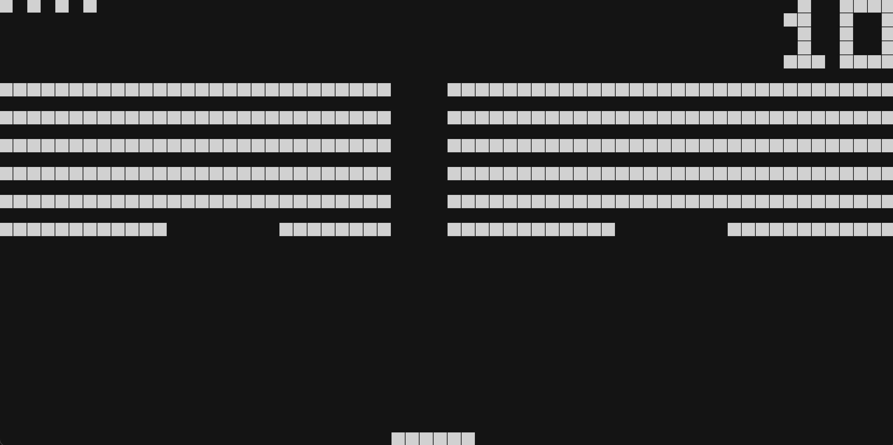

## ABOUT
CHIP-8 is an interpreted programming language that was developed in the 1970s.

This is my attempt to implement CHIP-8 and emulate the hardware that it might have ran on back in the day.  This project is written in C++ and uses SFML for the display.  [This guide](https://tobiasvl.github.io/blog/write-a-chip-8-emulator/) was used to implement the opcodes.

Below is a screenshot of the program running pong and breakout:




## HOW TO USE

1. **Clone the repository:**
    ```sh
    git clone https://github.com/charlin2/CHIpp8
    cd CHIpp-8
    ```

2. **Build the project using CMake:**
    ```sh
    mkdir build
    cd build
    cmake ..
    cmake --build .
    ```

3. **Run the emulator:**
    ```sh
    ./bin/main path/to/your/rom.ch8
    ```
    \*Note: ROMs can be found online with the extension `.ch8` or `.rom`.

    Valid input buttons are 1-4, Q-R, A-F, Z-V (i.e. a 4x4 grid for 16 total buttons).